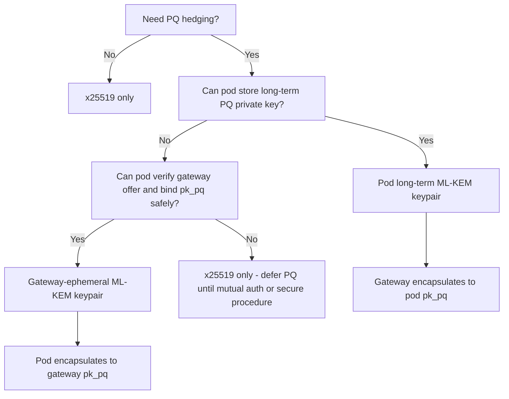
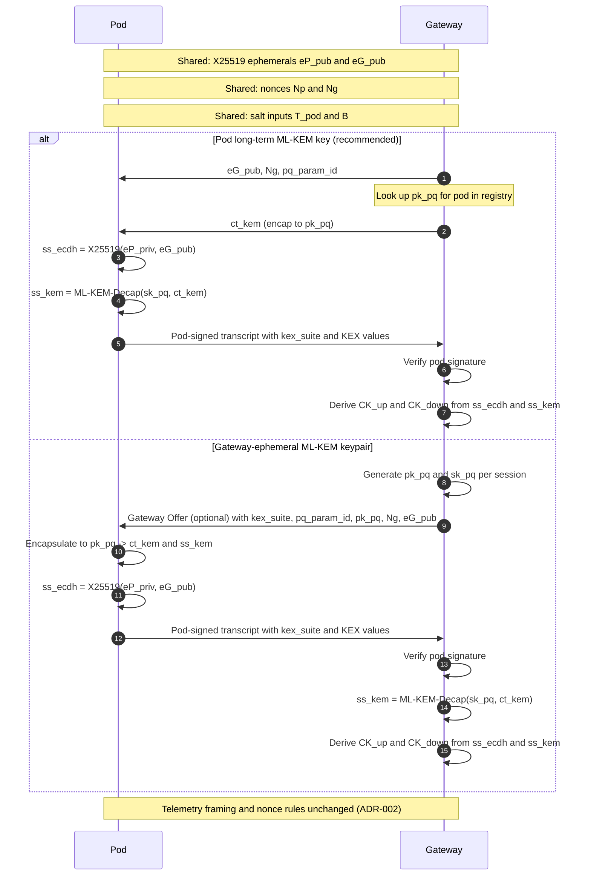

# ADR-036: Post-Quantum Hybrid Provisioning (X25519 + ML-KEM/Kyber)

**Status**: Proposed
**Date**: 2026-01-22

## Related ADRs

- [ADR-001](ADR-001-primitives-x25519-hkdf-xchacha.md): Cryptographic Primitives
- [ADR-005](ADR-005-pynacl-migration.md): PyNaCl Migration
- [ADR-006](ADR-006-forward-only-schema-and-salt8.md): Forward-only Schema and salt8
- [ADR-018](ADR-018-cryptographic-randomness-and-nonce-policy.md): Cryptographic Randomness and Nonce Policy
- [ADR-037](ADR-037-signature-roles-and-verification-boundaries.md): Signature roles and verification boundaries
- [ADR-049](ADR-049-native-evidence-plane-crypto-boundary-and-pynacl-demotion.md): native evidence-plane crypto boundary and PyNaCl demotion

## Context

TrackOne provisioning currently derives `CK_up`/`CK_down` from an ephemeral X25519 ECDH shared secret via HKDF-SHA256, with a non-secret `salt = SHA-256(Ng || Np || T_pod || B)` as documented in `src/includes/crypto_design.tex`.

As identified in ADR-001 (under the PQC roadmap, e.g., Kyber), exploring post-quantum (PQ) key agility is a planned enhancement. The motivation is "hedging": retaining security if either classical ECDH or the PQ primitive later weakens.

Constraints:

- Historical Python-first crypto used PyNaCl/libsodium; current evidence-plane
  runtime authority is `trackone_core` per ADR-049. Provisioning remains a
  lifecycle/control-plane concern unless and until TrackOne accepts a native
  provisioning surface.
- Telemetry framing and replay semantics must not change.
- Provisioning transcript is already Ed25519-signed by the pod and verified by the gateway (ADR-001; Flow A in ADR-037); this ADR extends the transcript with PQ fields and strengthens transcript binding (see ADR-037 for signature roles).
- Pods are MCU-class and provisioning traffic is constrained; ML-KEM must remain provisioning-only and may be infeasible on the smallest targets (e.g., STM32L0). Hybrid mode is therefore optional and may be deployed only on pods/gateways that can afford the CPU/RAM cost.

## Decision

Introduce an optional **hybrid provisioning mode** that combines:

- Classical: X25519 ECDH shared secret `ss_ecdh`
- Post-quantum: ML-KEM (Kyber) shared secret `ss_kem` via encapsulation/decapsulation

The hybrid mode derives the same `CK_up` and `CK_down` sizes and keeps the telemetry nonce/AAD rules unchanged. Only provisioning transcript content and key derivation inputs change.

### Security note: what "hybrid" does (and does not) guarantee

- `x25519+mlkem` provides post-quantum hedging only when the pod participates in ML-KEM (encapsulation/decapsulation depending on the deployment model). If a pod remains `x25519`-only, there is no post-quantum confidentiality for captured provisioning traffic (harvest-now, decrypt-later remains a classical risk).
- Downgrade resistance is not achieved by a signature alone; it requires that the party choosing `kex_suite` is authenticated and that policy is enforced. A pod-signed transcript prevents post-hoc substitution of `kex_suite`/KEX values *after the pod has committed to them*, but does not prevent an attacker from tricking a pod into signing a weaker suite unless the pod verifies a trusted provisioning offer or enforces a local policy (ADR-037).

### Versioning / Negotiation

- Add a provisioning parameter `kex_suite` with values:
  - `x25519` (current default)
  - `x25519+mlkem` (hybrid)
- Device table schema remains forward-only; introduce a new `_meta.kex_suite` field.
- If `kex_suite` is absent, treat as `x25519` for backward compatibility during rollout.

## Design Details

### PQ Component

For `x25519+mlkem`:

- Hybrid secret: `ss_ecdh` (from X25519) and `ss_kem` (from ML-KEM) are combined in the KDF; the remainder of this subsection describes how `ss_kem` is established.

#### Deployment models for ML-KEM

There are two deployment models for the ML-KEM keypair used during provisioning:

1. **Pod long-term ML-KEM key (recommended when pods support PQ)**

   - **Key ownership / storage:**
     - Each pod generates a long-term ML-KEM keypair `(pk_pq, sk_pq)` during manufacturing or first boot.
     - `pk_pq` is registered in the device registry alongside the pod's Ed25519 verification key.
     - `sk_pq` is stored only on the pod and never leaves the device.
   - **Provisioning flow:**
     - Gateway looks up `pk_pq` from the registry.
     - Gateway encapsulates to `pk_pq` producing `(ct_kem, ss_kem)`.
     - Pod decapsulates `ct_kem` with its `sk_pq` to derive the same `ss_kem`.
   - **Security properties:**
     - Stable post-quantum identity for the pod, analogous to the existing Ed25519 verification key.
     - Clear separation of roles: gateway never holds long-term PQ private keys.
     - A later compromise of a gateway does not retroactively expose past session keys *absent stored ephemeral secrets* and assuming ML-KEM security; transcripts may be logged, but they must not contain decapsulation secrets.
   - **Operational characteristics:**
     - Requires maintaining `pk_pq` in the registry (similar to Ed25519).
     - No additional provisioning round trips compared to current flow.
     - Key rotation is explicit: rotating `pk_pq` requires updating registry state and may be tied to device lifecycle events.
   - **When to use:**
     - Default for production deployments where pods can afford the CPU/RAM cost and can safely store long-term PQ keys.
     - Recommended whenever registry integration is available, as it avoids ambiguity about pod identity and simplifies auditing.

1. **Gateway-ephemeral ML-KEM keypair**

   - **Key ownership / storage:**
     - Gateway generates an ephemeral ML-KEM keypair `(pk_pq, sk_pq)` per provisioning session.
     - Gateway provides `pk_pq` (and `pq_param_id`) to the pod before the pod signs the transcript so the pod can encapsulate to `pk_pq` and bind it to the session. In Flow B (ADR-037), this SHOULD be delivered inside the gateway-signed \\emph{Provisioning Offer}. In Flow A (no gateway authentication), it may be an unsigned hello parameter, but the pod MUST still include the received `pk_pq` in its signed transcript.
     - `sk_pq` is held only by the gateway for the duration of the session and then erased.
   - **Provisioning flow:**
     - Gateway generates `(pk_pq, sk_pq)` at the start of the session.
     - Pod encapsulates to `pk_pq`, producing `(ct_kem, ss_kem)` and includes `ct_kem` in the signed transcript.
     - Gateway decapsulates `ct_kem` with `sk_pq` to derive the same `ss_kem`.
   - **Security properties:**
     - No long-term PQ private key on the pod; all PQ secrets on the gateway are ephemeral to the session.
     - Does **not** provide a stable PQ identity for the pod; identity continues to rely solely on existing Ed25519 keys.
     - Slightly larger attack surface on gateway infrastructure, which handles more cryptographic state, but without long-lived PQ key material.
   - **Operational characteristics:**
     - Does not require storing `pk_pq` in the device registry.
     - May introduce a minor amount of additional orchestration complexity (ensuring `pk_pq` is correctly communicated and bound to the session).
     - Simpler pod implementation if persistent PQ key storage is not yet available.
   - **When to use:**
     - Transitional environments where pods cannot yet provision or persist a long-term ML-KEM keypair.
     - Test, lab, or constrained deployments where avoiding any new registry fields is a priority.

In both models, the encapsulation/decapsulation steps are:

- During provisioning, one side encapsulates to the other's `pk_pq` producing `(ct_kem, ss_kem)`.
- The other side decapsulates `ct_kem` with its `sk_pq` yielding the same `ss_kem`.
- In the preferred model (pod has long-term `pk_pq`): the gateway encapsulates to the pod's `pk_pq`, producing `(ct_kem, ss_kem)` and sending `ct_kem` in the provisioning transcript; the pod decapsulates `ct_kem` with its `sk_pq` to recover `ss_kem`.

For pods that support ML-KEM, the recommended deployment model is the **pod long-term ML-KEM key** model, as it aligns with existing Ed25519 verification key handling, reduces provisioning round trips, and avoids ambiguity about post-quantum pod identity. For constrained pods (e.g., STM32L0-class) that remain classical, the system should continue using `kex_suite = x25519` while keeping algorithm agility hooks for future upgrades. The gateway-ephemeral model is supported but should be treated as a compatibility or migration path rather than the default.

#### Hybrid provisioning message flow (illustrative)

### Transcript Additions

Provisioning transcript MUST include, for hybrid mode, at minimum:

- `type = "trackone/provisioning_transcript"`
- `schema_version`
- `pod_id` (canonical pod identifier; `device_id` is a legacy alias)
- `kex_suite = x25519+mlkem`
- `ct_kem` (the ML-KEM ciphertext)
- a string field `pq_param_id` containing the PQ parameter set identifier (e.g., `"mlkem_768"`) to prevent cross-suite confusion
- `eG_pub` and `eP_pub` (the X25519 ephemeral public keys already used for `ss_ecdh`)
- `Ng`, `Np`, `T_pod`, and `B` (existing provisioning fields used for `salt`)
- if using the gateway-ephemeral model: `pk_pq` (gateway ephemeral ML-KEM public key)

The transcript MUST be encoded in a canonical form (matching existing provisioning transcript signing) and MUST be Ed25519-signed by the pod; the gateway verifies with the registered pod verification key (ADR-001). In hybrid mode, the signature MUST cover `kex_suite` and all KEX public values (`ct_kem`, `pq_param_id`, and `pk_pq` if present) to prevent downgrade or substitution. Signature roles and optional mutual authentication flows are defined in ADR-037.

### Canonical encoding

`transcript_bytes` MUST be produced by a deterministic, explicitly specified encoder so that Python and Rust implementations sign the same bytes for the same logical transcript fields.

- Required encoding: TrackOne Canonical CBOR profile (ADR-034), in an explicitly versioned provisioning transcript schema.
- JSON encodings are NOT permitted for signed transcript bytes unless a future ADR explicitly updates ADR-034 and ADR-037.

Implementations MUST NOT sign “pretty JSON” or any non-canonical map encoding, and verifiers MUST treat non-canonical encodings as invalid.

### Transcript Hashing / Binding

To ensure derived channel keys are *explicitly bound* to the signed transcript (and not only to the raw shared secrets), compute:

- `th = SHA-256(transcript_bytes)` where `transcript_bytes` are the canonical bytes that the pod signs.

Implementations MUST NOT include the Ed25519 signature bytes inside `transcript_bytes` (to avoid circularity); `th` is computed over the unsigned transcript content.

### Combiner / Key Derivation

Keep existing `salt = SHA-256(Ng || Np || T_pod || B)`.

Derive PRK using HKDF-Extract with explicit domain separation:

- Let `ikm = ss_ecdh || ss_kem`
- Let `salt_h = SHA-256(salt || th || "barnacle:kex:x25519+mlkem")`
- `PRK = HKDF-Extract(salt_h, ikm)`

Then derive channel keys unchanged (but fixed labels):

- `CK_up   = HKDF-Expand(PRK, "barnacle:up",   32)`
- `CK_down = HKDF-Expand(PRK, "barnacle:down", 32)`

Rationale:

- Concatenation inside HKDF-Extract is acceptable when both secrets have fixed lengths and are clearly ordered.
- X25519 produces a 32-byte `ss_ecdh`, and ML-KEM-768 (recommended) produces a 32-byte `ss_kem`, yielding `ikm` of length 64 bytes; if a different PQ KEM or parameter set is used, implementers MUST ensure both inputs remain fixed-length and ordered before relying on this concatenation construction.
- `salt` and `th` are both SHA-256 outputs (32 bytes each), and the suite label is a fixed ASCII string; therefore `salt || th || label` is byte-unambiguous without additional length prefixes.
- Additional suite label mixed into `salt_h` provides robust domain separation and prevents accidental cross-mode key reuse.

### Failure Handling

- If ML-KEM decapsulation detects malformed input (e.g., incorrect ciphertext length for the parameter set), provisioning MUST abort (do not fall back silently).
- If `kex_suite` mismatches between parties, abort.
- No "opportunistic downgrade": gateway/operator policy controls `kex_suite`; mismatches are considered errors.
- Implementations MUST perform strict, early checks before expensive KEM operations: verify `pq_param_id` is supported; enforce exact expected lengths for `ct_kem` (and `pk_pq` when present); and rate-limit provisioning attempts to reduce DoS/battery griefing risk.
- When chain-of-trust provisioning records are used (ADR-019), gateways MUST validate the Provisioning Record signature (per ADR-037 verification rules) before trusting `pk_pod_ed25519` to verify the transcript.

## Consequences

Benefits:

- Hedge against future quantum attacks on X25519 by adding a PQ secret.
- Limits blast radius: telemetry framing, replay policy, and AEAD construction stay unchanged.
- Clear auditability: the transcript explicitly records the suite and PQ ciphertext.

Costs:

- Larger provisioning transcript: for ML-KEM-768, the PQ ciphertext `ct_kem` adds 1088 bytes (and the PQ public key `pk_pq` is 1184 bytes) compared to the current X25519-only flow. This is a significant but one-time cost during device onboarding and does not affect regular telemetry frames, which remain within the 40–60 byte target from ADR-001.
- More implementation and test surface (new primitive, vector generation, negative tests).
- Requires dependency support. Because ADR-049 demotes PyNaCl from primary
  runtime authority, any TrackOne-owned hybrid provisioning surface should prefer
  Rust/native implementation through `trackone_core` or another explicitly
  accepted binding.

## Implementation Notes (Non-Normative)

- Implement hybrid provisioning first in Rust (`trackone-core` /
  `trackone_core`) if TrackOne accepts ownership of that surface, with
  equivalence tests and deterministic vectors. PyNaCl/libsodium may still be used
  as optional comparison tooling where available, but not as the default
  evidence-plane runtime dependency.
- Add deterministic vectors to `toolset/unified/crypto_test_vectors.json` for:
  - X25519-only provisioning (baseline)
  - Hybrid provisioning (`mlkem_768` recommended starting point: NIST Level 3, roughly matching X25519's ~128-bit classical security while keeping ciphertext/key sizes and CPU cost acceptable for ultra-low-power pods; `mlkem_512` would under-shoot this target and `mlkem_1024` increases bandwidth/CPU without clear benefit for the current threat model)
- Ensure all random generation uses CSPRNG per ADR-018.

## Security Considerations

- This ADR provides "at least one holds" security assuming the HKDF combiner and domain separation are used as specified.
- Hybrid does not help if endpoint keys are compromised (pod/gateway fully owned).
- Hybrid does not provide post-quantum confidentiality for pods that remain `x25519`-only; PQ hedging applies only when ML-KEM participation is enabled on the pod side.
- A downgrade attack is mitigated by:
  - including `kex_suite` in the signed transcript
  - enforcing policy at the party that can be tricked (typically the pod) via local rules and/or a verifiable gateway provisioning offer (Provisioning Offer / Gateway Hello; Flow B in ADR-037)

Provisioning is also exposed to DoS and battery griefing risks:

- Large `ct_kem` / `pk_pq` inputs (or repeated attempts) can consume airtime and CPU if not rejected early.
- Mitigate by strict length checks and supported-suite gating before expensive operations, plus rate limiting / lockouts on repeated failures.

Gateway compromise timing matters:

- If a gateway is compromised during provisioning, an attacker may tamper with negotiation, exfiltrate ephemeral secrets, or force downgrade unless mutual authentication and policy enforcement are in place.
- If compromised after provisioning, stored transcripts may be exposed; confidentiality then depends on ML-KEM/X25519 security and the absence of stored session secrets.

### Long-term ML-KEM key management (pods)

- Key storage:
  - Each pod that participates in ML-KEM-based hybrid provisioning holds a long-term ML-KEM keypair (`pk_pq`, `sk_pq`), with `pk_pq` registered in the provisioning registry.
  - `sk_pq` MUST remain on the device and MUST NOT be exported off-device in plaintext. It SHOULD be protected using the strongest available mechanism for the pod platform:
    - **Preferred:** secure element / hardware-backed key storage.
    - **MCU baseline:** internal flash with readout protection (e.g., STM32 RDP) and no debug access in field deployments.
  - `sk_pq` MUST NEVER be logged, included in telemetry, or transmitted over any channel.
- Key rotation:
  - ML-KEM long-term keys SHOULD be rotated periodically or on operator demand, using similar *operational* ideas to channel-key rotation (versioning, rollout windows), but note that PQ key rotation is a registry update, not a symmetric channel-key re-derivation.
  - Rotation consists of: generating a new ML-KEM keypair on the pod, registering the new `pk_pq` under a new `pq_key_id` in the registry, and phasing out the old key according to operator policy (grace window, staged rollout).
  - Rotation SHOULD preserve the pod's existing identity (Ed25519) and attestations. In highly constrained deployments, rotation may still require a maintenance provisioning session; this ADR does not mandate always-online key rollover.
- Compromise handling:
  - If `sk_pq` is suspected or confirmed to be compromised, the corresponding `pk_pq` in the registry MUST be marked revoked/compromised, and new provisioning or channel establishment requests using that key MUST be rejected.
  - After remediation on the device, a fresh ML-KEM keypair MUST be generated and registered before the pod resumes hybrid provisioning.
  - Compromise of `sk_pq` does not weaken past sessions that used an independent classical ECDH key under the “at least one holds” model, but future confidentiality for that pod MUST be considered lost until rotation is completed.

## Acceptance Criteria

- Documentation:
  - `src/includes/crypto_design.tex` is updated to reference ADR-036, describing the optional hybrid provisioning mode at a high level and explaining its relationship to the PQC roadmap (Dilithium/Kyber at gateways) mentioned in ADR-001.
- Tests:
  - Deterministic test vectors validate both suites.
  - Negative tests: suite mismatch, modified `ct_kem`, decapsulation failure, transcript tampering.
- Compatibility:
  - Existing `x25519` provisioning continues to work unchanged unless hybrid is explicitly enabled.
