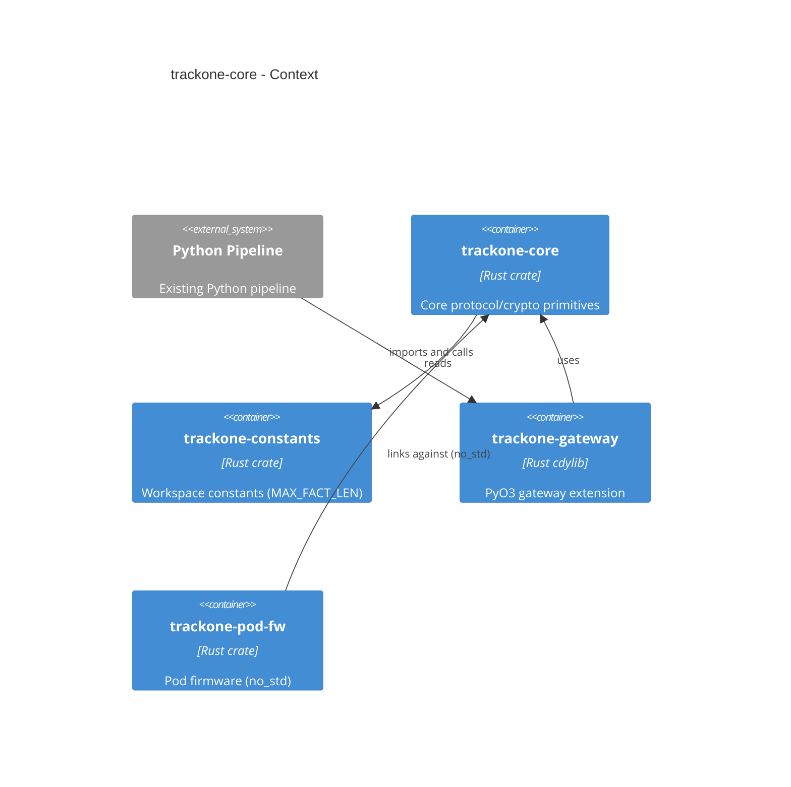

# trackone-core

# Overview

`trackone-core` is the shared Rust crate containing the protocol model, serialization, and cryptographic abstractions used by both gateway and firmware components.

## Purpose

- Define core data types (`PodId`, `FrameCounter`, `Fact`, `FactPayload`, `EncryptedFrame`).
- Provide AEAD traits and key types for pluggable crypto implementations.
- Provide framing helpers: `make_fact`, `encrypt_fact`, and `decrypt_fact` (postcard + AEAD).
- Provide gateway-only Merkle helpers under an opt-in feature.

## Responsibilities and dependencies

- Responsibilities:
  - Authoritative implementation of protocol types and framing logic.
  - No-std-first design with an opt-in `std` feature for host/gateway builds.
- Dependencies:
  - `trackone-constants`, `heapless`, `postcard`, `serde`, `zeroize`, and optionally `sha2` (behind `gateway`).
- Consumers:
  - `trackone-gateway` (host bindings and Python extension).
  - `trackone-pod-fw` (firmware builds).

## Feature model

- `std` — opt-in standard library support.
- `gateway` — host-specific helpers that require `std` and `sha2`.
- `dummy-aead` — a small test-only AEAD implementation enabled by default for development convenience. Firmware builds should disable default features.

## Architecture diagram

