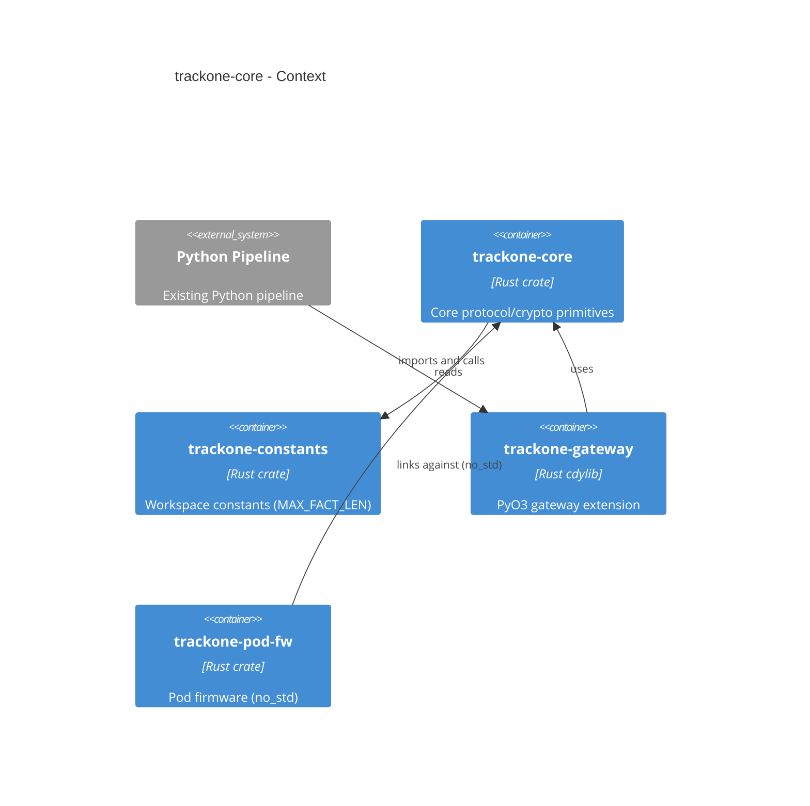

# trackone-core

# Overview

`trackone-core` is the shared Rust crate containing the protocol model, serialization, cryptographic abstractions, and provisioning records used by both gateway and firmware components.

## Purpose

- Define core data types (`PodId`, `FrameCounter`, `Fact`, `FactPayload`, `EncryptedFrame`, `EnvFact`)
- Provide AEAD traits and key types for pluggable crypto implementations
- Provide framing helpers: `make_fact`, `encrypt_fact`, and `decrypt_fact` (postcard + AEAD)
- Provide gateway-only Merkle helpers under an opt-in feature
- Provide provisioning records (`ProvisioningRecord`, `PolicyUpdate`) for device identity and chain of trust
- Provide deterministic CBOR encoding for cryptographic commitments

## Responsibilities and dependencies

- Responsibilities:
  - Authoritative implementation of protocol types and framing logic
  - Provisioning records for device identity and chain of trust
  - Deterministic CBOR encoding for cryptographic commitments
  - No-std-first design with an opt-in `std` feature for host/gateway builds
- Dependencies:
  - `trackone-constants`, `heapless`, `postcard`, `serde`, `serde_repr`, `serde-big-array`, `zeroize`
  - Optional: `sha2` (behind `gateway`), `ciborium` (behind `std`)
- Consumers:
  - `trackone-gateway` (host bindings and Python extension)
  - `trackone-pod-fw` (firmware builds)

## Feature model

- `std` — opt-in standard library support (enables CBOR module and `ciborium` dependency)
- `gateway` — host-specific helpers that require `std` and `sha2` (Merkle tree support)
- `dummy-aead` — a small test-only AEAD implementation intended for local development and testing. **Production builds should not enable this.**
- `production` — strict build profile that refuses to compile with `dummy-aead` enabled (compile-time safety check)

## Architecture diagram

