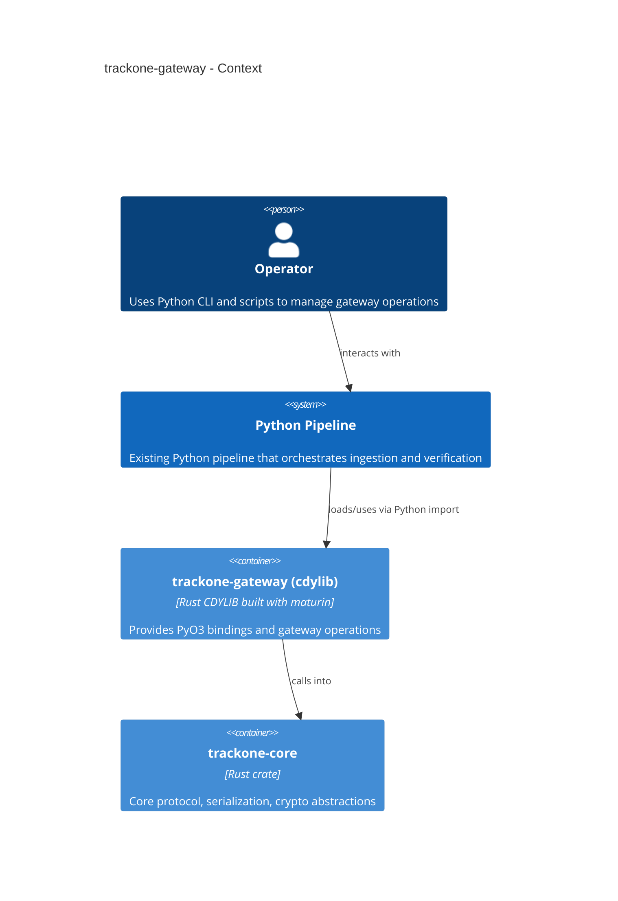

# trackone-gateway

# Overview

`trackone-gateway` is the Rust cdylib that provides a Python extension exposing gateway-side operations.

## Purpose

- Bind `trackone-core` to Python via PyO3.
- Offer gateway-specific helpers (batching, Merkle root computation, anchoring integrations).
- Ship a Python wheel via `maturin` for use in downstream Python tooling.

## Responsibilities and dependencies

- Responsibilities:
  - Provide a stable, documented Python API that delegates heavy work to `trackone-core`.
  - Wrap host-only operations requiring `std`.
- Dependencies:
  - `trackone-core` with the `gateway` feature enabled.
  - `pyo3` for Python bindings.
- Consumers:
  - Python pipeline scripts and CI jobs.

## Architecture diagram

