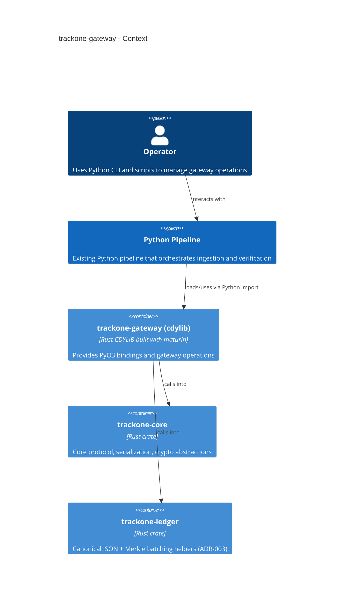

# trackone-gateway

# Overview

`trackone-gateway` is the Rust cdylib that provides a Python extension exposing gateway-side operations.

## Purpose

- Bind `trackone-core` to Python via PyO3.
- Offer gateway-specific helpers (batching, Merkle root computation, anchoring integrations).
- Ship a Python wheel via `maturin` for use in downstream Python tooling.

## Python API

The extension module is imported as `trackone_core` (see `pyproject.toml`).

Currently exposed:

- `Gateway` / `GatewayBatch` for simple frame batching + Merkle root computation (ADR-003 policy).
- `trackone_core.merkle.merkle_root_bytes(...)` and `trackone_core.merkle.merkle_root_hex(...)`.
- `trackone_core.merkle.merkle_root_hex_and_leaf_hashes(...)` for batching parity with the Python reference pipeline.
- Ledger helpers (ADR-003):
  - `trackone_core.ledger.canonicalize_json_bytes(...)`
  - `trackone_core.ledger.build_day_v1_single_batch(...)` (canonical block header + `day.bin` bytes)
- `PyRadio` adapter for delegating frame I/O to Python implementations (`send_frame`, optional `receive_frame`).

## Responsibilities and dependencies

- Responsibilities:
  - Provide a stable, documented Python API that delegates heavy work to `trackone-core` and `trackone-ledger`.
  - Wrap host-only operations requiring `std`.
- Dependencies:
  - `trackone-core` with the `gateway` feature enabled.
  - `trackone-ledger` for canonicalization + ADR-003 Merkle policy helpers.
  - `pyo3` for Python bindings.
- Consumers:
  - Python pipeline scripts and CI jobs.

## Architecture diagram

