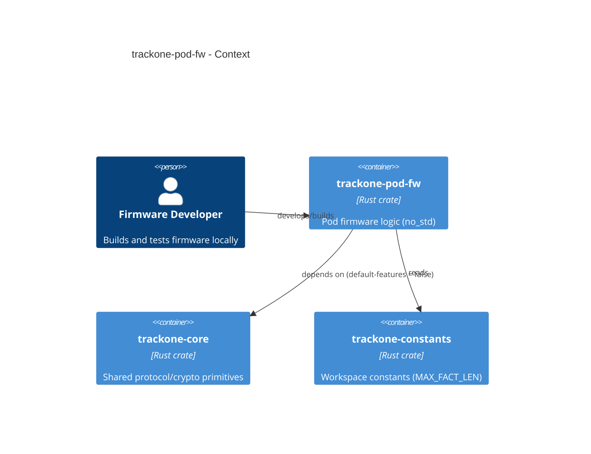

# trackone-pod-fw

C4 level: **Component** representing pod firmware logic within the TrackOne system.

# Overview

`trackone-pod-fw` is a crate intended for pod/firmware logic. It provides the glue that collects sensor data, constructs `Fact` structures, and emits encrypted frames.

## Purpose

- Construct `Fact` values from sensor inputs.
- Encrypt facts using an AEAD implementation that satisfies the core AEAD traits.
- Emit encrypted frames to the transport layer (radio).

## Responsibilities and dependencies

- Responsibilities:
  - Keep runtime code small and `no_std`-friendly.
- Dependencies:
  - `trackone-core` with `default-features = false` (no `std`, no `dummy-aead`).
  - Platform-specific HALs / radio stacks (not included in this workspace yet).
- Consumers:
  - Firmware binary crates or board support packages.

## Architecture diagram

