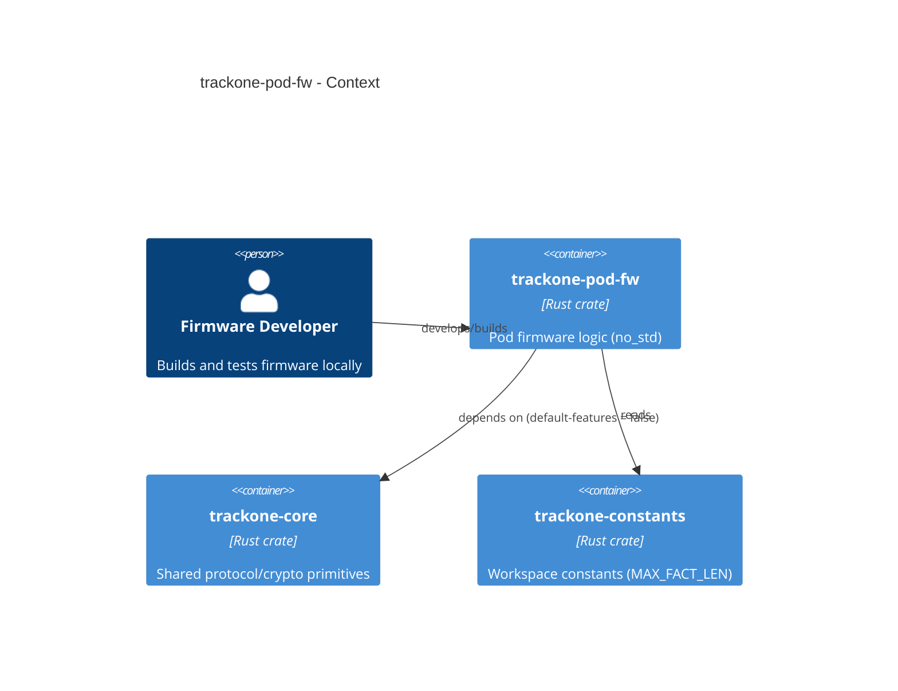

# trackone-pod-fw

**Component** representing pod firmware logic within the TrackOne system.

# Overview

`trackone-pod-fw` is a crate intended for pod/firmware logic. It provides the glue that collects sensor data, constructs `Fact` structures, and emits encrypted frames.

Additional firmware-side notes and patterns are documented in the broader [TrackOne firmware documentation](../../docs/pod-fw.md).

## Purpose

- Construct `Fact` values from sensor inputs.
- Encrypt facts using an AEAD implementation that satisfies the core AEAD traits.
- Emit encrypted frames to the transport layer (radio).

## Included utilities

- `Pod` helper to construct + encrypt facts into `EncryptedFrame<N>` using `trackone-core::frame`.
- `CounterNonce24` nonce generator (24-byte) suitable for embedded use (ADR-018).
- `hal` module with small hardware abstraction traits (GPIO, clocks, buses, RNG, power) and optional mocks (`mock`, `mock-log` features).
- `power` helpers: `idle_wait`, `enter_low_power`, and `EventWaiter`.
- `stress` helpers: stack-guard paint/scan utilities for high-water mark checks.
- `watchdog` helpers (feature `wdg`) for quorum-based hardware watchdog feeding and local reset-count persistence.

## Feature model

- `wdg` enables the watchdog/liveness-registry helpers.
- `mock-hal` enables host-side mock HAL implementations for tests and local bring-up.
- `mock-log` adds `println!` tracing to the mock HALs.
- `production` implies `wdg` and must be built with `mock-hal` disabled.

## Responsibilities and dependencies

- Responsibilities:
  - Keep runtime code small and `no_std`-friendly.
- Dependencies:
  - `trackone-core` with `default-features = false` (no `std`, no `dummy-aead`).
  - Platform-specific HALs / radio stacks (not included in this workspace yet).
- Consumers:
  - Firmware binary crates or board support packages.

## Architecture diagram

