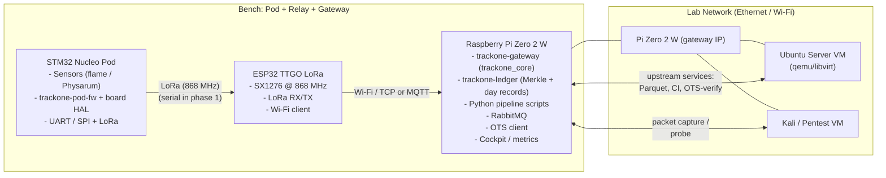

# TrackOne Bench Network – V0

This document describes the first “bench-scale” TrackOne deployment used for
integration, performance, and security testing.

The goal is to mirror the real-world topology in a controllable lab:

- A **pod** (STM32 Nucleo with sensors) generating telemetry frames.
- A **relay** (ESP32 TTGO LoRa) bridging low-power radio to IP.
- A **gateway** (Raspberry Pi Zero 2 W) running TrackOne services.
- One or more **auxiliary VMs** (Ubuntu Server, Kali) acting as upstream
  infrastructure and adversarial test nodes.

Notes on repo layout:

- Pod-side Rust logic now lives under `crates/trackone-pod-fw` (generic, `no_std`-friendly).
- Ledger/commitment rules live under `crates/trackone-ledger` (canonical JSON + Merkle policy, ADR-003).
- Gateway-side Rust extension lives under `crates/trackone-gateway` (PyO3 module: `trackone_core`).
- The legacy bench firmware prototype has been retired; key utilities were promoted into the crates above.

______________________________________________________________________

## 1. Components

### 1.1 Pod node (Nucleo + sensor)

- Hardware:
  - ST Nucleo-L476RG (Cortex-M4F) dev board.
  - Sensor front-end:
    - For now: flame sensor / basic analog input.
    - Later: Physarum bio-impedance front-end and environmental sensors.
- Firmware:
  - Pod logic from `trackone-pod-fw` plus board-specific HAL + radio stack.
  - Produces encrypted, AEAD-protected frames with `(pod_id, fc)` counters.
- Connectivity:
  - Phase 1: UART → USB serial to Pi (for bring-up / debugging).
  - Phase 2: SPI to SX1276 (LoRa) module, RF link to TTGO.

### 1.2 Relay node (TTGO LoRa / ESP32)

- Hardware:
  - TTGO LoRa V2.1 (ESP32 + SX1276 @ 868 MHz).
- Firmware:
  - Meshtastic or a custom “LoRa relay” firmware.
  - Receives LoRa frames from pods and forwards them upstream via Wi‑Fi.
- Connectivity:
  - LoRa RF: uplink from one or more pods.
  - Wi‑Fi: TCP/UDP to the Raspberry Pi gateway.

### 1.3 Gateway node (Raspberry Pi Zero 2 W)

- Hardware:
  - Raspberry Pi Zero 2 W (or similar Pi).
- Services:
  - TrackOne gateway stack (Rust + Python parts), including:
    - Ingest service: receives frames from TTGO (e.g., over TCP or MQTT).
    - Merkle batcher: builds daily Merkle roots and day blobs.
    - OTS anchor: stamps day blobs against Bitcoin via OTS.
    - Export: optional Parquet/columnar export (per ADR on Parquet).
  - Messaging:
    - RabbitMQ instance for decoupled ingestion → processing pipeline.
  - Observability:
    - Cockpit and/or Grafana/Prometheus (later) for system metrics.

### 1.4 Auxiliary VMs (KVM)

- Ubuntu Server / Core VM:
  - Runs “cloud-side” TrackOne services that don’t fit on Pi, if needed.
  - Can host:
    - CI agents,
    - Long-term storage (PostgreSQL / MinIO / Parquet lake),
    - Additional OTS verification endpoints.
- Kali / security toolkit VM:
  - Used for:
    - Traffic inspection (Wireshark, tcpdump, tshark),
    - Active probing (nmap/nbtscan, mitmproxy) to validate hardening,
    - Verifying that only intended ports / protocols are exposed.

Network-wise, these VMs live on the same virtual network as the Pi, so they
see the same traffic patterns that a real upstream operator would.

______________________________________________________________________

## 2. High-level network diagram

The diagram below captures the V0 bench topology. It intentionally keeps the
pod side simple (one pod) but is meant to generalize to N pods later.

