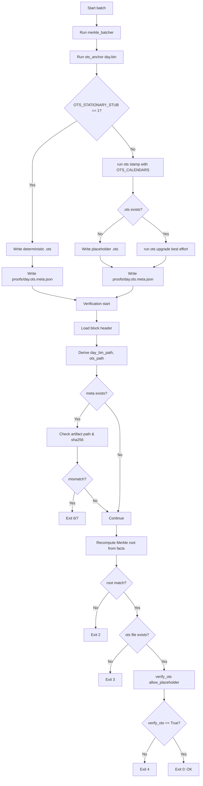

# OpenTimestamps Verification (ADR-007)

This guide explains how we verify OpenTimestamps (OTS) proofs locally and in CI using Bitcoin Core headers-only mode.

References: ADR-003 (anchoring policy), ADR-007 (CI headers policy).

## Local verification

Prerequisites:

- OpenTimestamps client: `pip install opentimestamps-client`
- Bitcoin Core (bitcoind/bitcoin-cli) installed and on PATH

Start headers-only/pruned node and verify:

```bash
# Start bitcoind in headers-only mode
bitcoind -daemon \
  -listen=0 \
  -blocksonly=1 \
  -prune=550 \
  -txindex=0 \
  -dbcache=50 \
  -maxconnections=8

# Verify a proof (once headers have reached required heights)
ots verify out/site_demo/day/2025-10-07.bin.ots
```

Alternatively, use the helper target (wraps our CI script):

```bash
# Default: lenient; timeout defers verification without failing
make ots-verify

# Strict: fail if headers don’t catch up within TIMEOUT_SECS
STRICT_VERIFY=1 TIMEOUT_SECS=900 make ots-verify
```

## CI verification (GitHub Actions)

Workflow: `.github/workflows/ots-verify.yml`

Key points (ADR-007):

- Downloads Bitcoin Core from bitcoincore.org and runs headers-only.
- Caches `~/.bitcoin` across runs for fast re-verification.
- Parses required block heights from `.ots` files with `ots info`.
- Waits until headers reach the highest required height (timeout configurable).
- Policy: strict on `main` (timeouts fail), lenient on PRs (timeouts defer).
- Uploads `~/.bitcoin/debug.log` on failure for debugging.

Path filters: This workflow runs only when OTS-related files change (workflow, helper script, ADR-007, gateway OTS tools, or these docs).

## Running the stationary calendar locally

For local development and CI-style testing against a real OTS calendar (instead
of the stationary stub), you can run the official OTS calendar in Docker.

A minimal compose file is provided as `docker-compose.ots.yml`:

```yaml
version: '3.8'

services:
  ots-calendar:
    image: ots/calendar:latest
    container_name: ots-calendar
    restart: unless-stopped
    ports:
      - "8468:8468"
    environment:
      OTS_LOG_LEVEL: info
    volumes:
      - ./data/ots-calendar:/var/lib/ots-calendar
```

To start the calendar locally:

```bash
docker compose -f docker-compose.ots.yml up -d ots-calendar
```

Then point the gateway tools at this calendar via `OTS_CALENDARS` and disable
stub mode when you want real OTS behavior:

```bash
export OTS_STATIONARY_STUB=0
export OTS_CALENDARS="http://127.0.0.1:8468"

# Anchor a day blob against the local calendar
python scripts/gateway/ots_anchor.py out/site_demo/day/2025-10-07.bin

# Run the real-OTS integration tests
RUN_REAL_OTS=1 pytest -m real_ots tests/integration/test_ots_integration.py
```

The `tox -e ots-cal` environment and `.github/workflows/ots-cal.yml` workflow
use the same pattern: start a local `ots-calendar` container, set
`OTS_STATIONARY_STUB=0` and `OTS_CALENDARS` to `http://127.0.0.1:8468`, then run
only the `real_ots` tests. This gives ADR-014 a concrete, reproducible path
from the stationary stub in unit tests to a real calendar in CI.

## Troubleshooting

- `bitcoind: command not found`: Ensure Bitcoin Core is installed and on PATH. In CI, the workflow exports PATH within the install step before invoking `bitcoind`.
- `Could not connect to Bitcoin node`: Wait for headers to sync or increase timeout. Use the lenient mode on PRs to avoid failing reviews.
- `ots verify` still fails after headers: Run `ots info <file.ots>` and confirm the `BitcoinBlockHeaderAttestation(<height>)` is ≤ current headers (`bitcoin-cli -getinfo`).

## Stationary vs real calendar modes

In addition to header-based verification, the gateway supports two OTS operating
modes for stamping day blobs:

- **Stationary stub mode** (used in tests and fast CI):

  - Enabled by `OTS_STATIONARY_STUB=1` (this is the default in the pytest
    suite via `tests/conftest.py`).
  - `ots_anchor.py` does **not** call the real `ots` binary. Instead it writes a
    deterministic stub proof of the form `STATIONARY-OTS:<sha256(day.bin)>` and
    an `ots_meta` sidecar (`proofs/<day>.ots.meta.json`).
  - `verify_cli.py` validates the stub by comparing the embedded hex digest
    against the actual SHA-256 of `day.bin` (or the `artifact_sha256` from the
    meta file). This gives strong immutability guarantees without network
    traffic.

- **Real calendar mode** (used in `real_ots` tests and ops):

  - `OTS_STATIONARY_STUB=0` (or unset) and an `ots` binary available.
  - `ots_anchor.py` invokes `ots stamp` (and optionally `ots upgrade`) via a
    small helper that forwards `OTS_CALENDARS` to select calendars (e.g., a
    local stationary calendar, then public pools).
  - `verify_cli.py` falls back to `ots verify` when a stub or placeholder is
    not recognized.

### UML activity diagram

The high-level flow from batching to verification, including stationary vs real
calendar branches, is captured in the following Mermaid diagram:



The `verify_ots` step recognizes three proof shapes:

- `OTS_PROOF_PLACEHOLDER` (optional, allowed when `--allow-placeholder` is
  effective).
- `STATIONARY-OTS:<hex>` (checked against `artifact_sha256` or `sha256(day.bin)`).
- Real OTS proofs verified via `ots verify` when a client is available.

This diagram, together with ADR-014, describes the intended behavior for both
local development and CI.

## Notes

- For air-gapped deployments, verification must be performed on a machine with up-to-date headers or via trusted header bundles.
- Do not commit upgraded `.ots` proofs from CI; prefer to upload as artifacts if needed.
